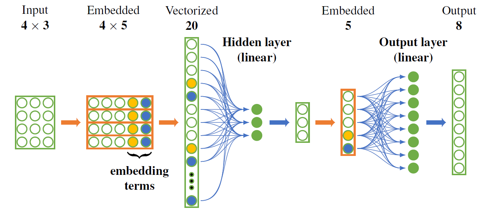
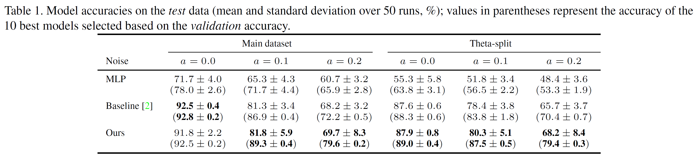

# Embed Me If You Can: A Geometric Perceptron

This repository is the official implementation of the "Embed Me If You Can: A Geometric Perceptron" paper.



## The proposed MLGP model
 
 


## Requirements
> 📋We achieved the original results with Python 3.6.5, ```torch==1.2.0+cu92```, ```scikit-learn==0.19.1```, ```scipy==1.4.1```, ```numpy==1.15.0```, and ```matplotlib==3.0.3```, but we needed to relax the requirements to facilitate the installation.

To install the requirements, run:

```setup
pip install -r requirements.txt
```


## Demo

The ```mlgp_demo.ipynb``` (```mlgp_demo.html```) notebook demonstrates the training and evaluation of our MLGP model and the analysis and visualization of its hidden units.


## Training

To train the model(s) in the paper, run the following command:

```
python train.py 
```

> 📋Uncomment specific lines in ```train.py``` to use various models described in the paper (default are original hyperparameters). Adjust the ```get_tetris_data```  function arguments accordingly.



## Evaluation

To evaluate one of the trained models on the corresponding test dataset, run:


```
python eval.py
```

> 📋 Depending on the choice of a trained model, modify the ```MODEL_PATH``` variable and the ```create_test_set``` function arguments in the ```eval.py``` script (examples are provided).



## Pre-trained models

You can find the pre-trained models in the ```pretrained_models``` folder.



## Results


The performances of the models on the test data and in all experiments are presented in Table 1.





> 📋Use ```train.py``` script to train the models with the provided seeds. Use ```eval.py``` to evaluate the models on the corresponding test sets. 



